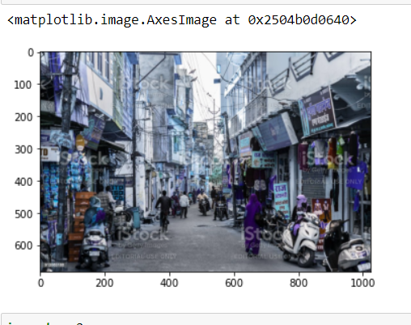
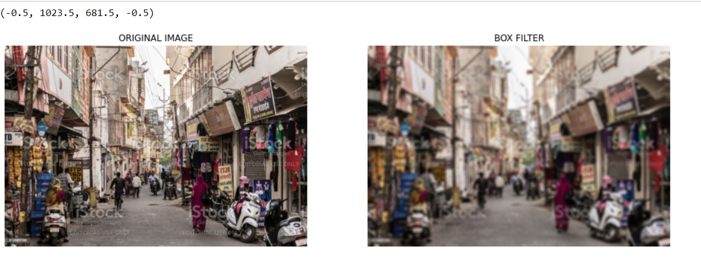
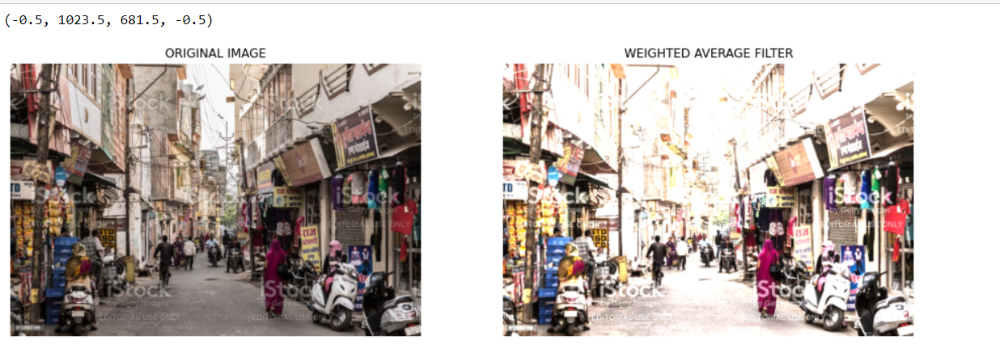
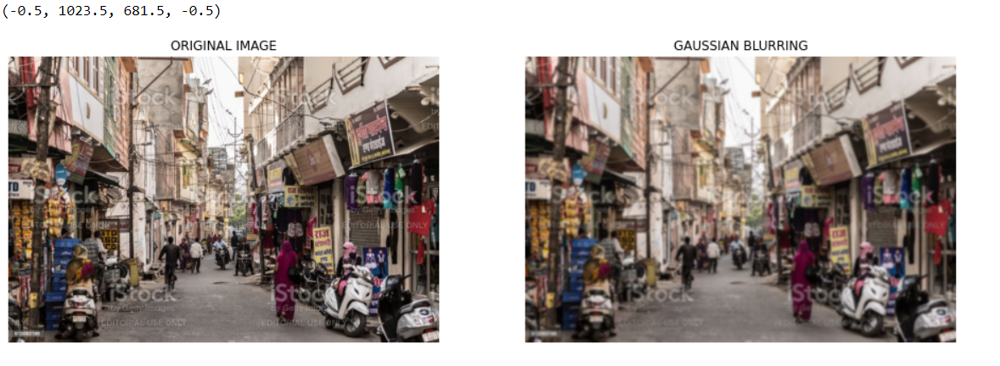
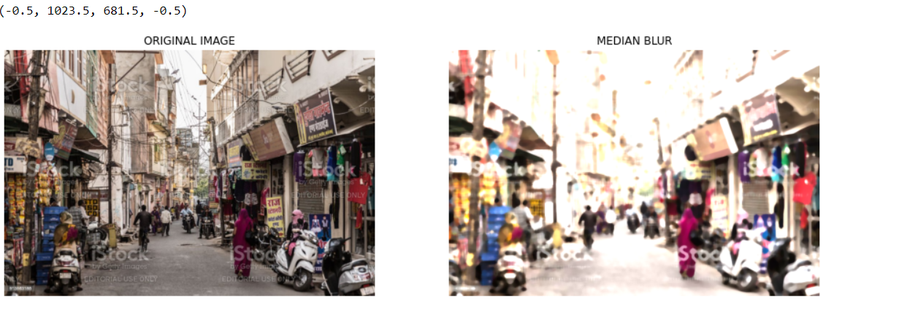
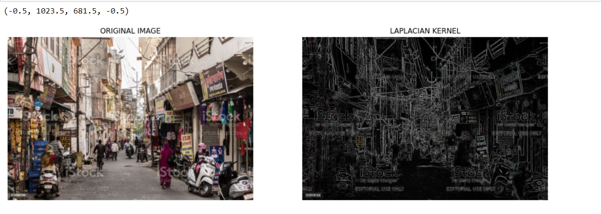
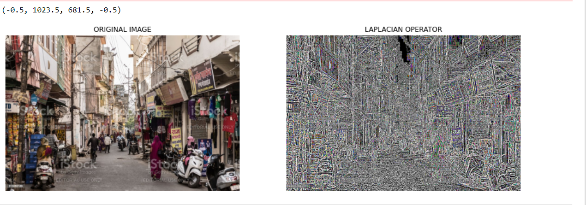

# Implementation-of-Filters
## Aim:
To implement filters for smoothing and sharpening the images in the spatial domain.

## Software Required:
Anaconda - Python 3.7

## Algorithm:
### Step 1:
Import the necessary modules.

### Step 2:
Perform smoothing operation on a image.

Average filter

Weighted average filter

Gaussian Blur

Median filter
### Step 3:
Perform sharpening on a image.

Laplacian Kernel

Laplacian Operator
### Step 4:
Display all the images with their respective filters.

## Program:
~~~
 Developed By   : ANISH MJ
 Register Number: 212221230005
~~~

### 1. Smoothing Filters

i) Using Averaging Filter

~~~
kernel = np.ones((11,11),np.float32)/121
image3 = cv2.filter2D(image2,-1,kernel)
plt.imshow(image3)

plt.figure(figsize = (16,16))
plt.subplot(1,2,1)
plt.imshow(image2)
plt.title("ORIGINAL IMAGE")
plt.axis('off')

plt.subplot(1,2,2)
plt.imshow(image3)
plt.title("BOX FILTER")
plt.axis('off')
~~~

ii) Using Weighted Averaging Filter
~~~
kernel1 = np.array([[8,17,7],[10,64,10],[3,5,4]])/64
image3 = cv2.filter2D(image2,-1,kernel1)
plt.imshow(image3)

plt.figure(figsize = (16,16))
plt.subplot(1,2,1)
plt.imshow(image2)
plt.title("ORIGINAL IMAGE")
plt.axis('off')

plt.subplot(1,2,2)
plt.imshow(image3)
plt.title("WEIGHTED AVERAGE FILTER")
plt.axis('off')
~~~

iii) Using Gaussian Filter

~~~
gauss_blur = cv2.GaussianBlur(src=image2, ksize=(11,11),sigmaX=0, sigmaY=0)
plt.imshow(gauss_blur)

plt.figure(figsize=(16,16))
plt.subplot(1,2,1)
plt.imshow(image2)
plt.title("ORIGINAL IMAGE")
plt.axis('off')

plt.subplot(1,2,2)
plt.imshow(gauss_blur)
plt.title("GAUSSIAN BLURRING")
plt.axis('off')

~~~

iv) Using Median Filter
~~~
median = cv2.medianBlur(src=image3,ksize=11)
plt.imshow(median)

plt.figure(figsize=(16,16))
plt.subplot(1,2,1)
plt.imshow(image2)
plt.title("ORIGINAL IMAGE")
plt.axis('off')

plt.subplot(1,2,2)
plt.imshow(median)
plt.title("MEDIAN BLUR")
plt.axis('off')
~~~

### 2. Sharpening Filters
i) Using Laplacian Kernal
~~~
kernel2 = np.array([[1,1,1],[1,-8,1],[1,1,1]])
laplacian_kernel = cv2.filter2D(image2,-1,kernel2)
plt.imshow(laplacian_kernel)

plt.figure(figsize=(16,16))
plt.subplot(1,2,1)
plt.imshow(image2)
plt.title("ORIGINAL IMAGE")
plt.axis('off')

plt.subplot(1,2,2)
plt.imshow(laplacian_kernel)
plt.title("LAPLACIAN KERNEL")
plt.axis('off')
~~~
ii) Using Laplacian Operator
~~~
laplacian_operator = cv2.Laplacian(image2,cv2.CV_64F)
plt.imshow(laplacian_operator)

plt.figure(figsize=(16,16))
plt.subplot(1,2,1)
plt.imshow(image2)
plt.title("ORIGINAL IMAGE")
plt.axis('off')

plt.subplot(1,2,2)
plt.imshow(laplacian_operator)
plt.title("LAPLACIAN OPERATOR")
plt.axis('off')
~~~

## OUTPUT:

### Original Image

### 1. Smoothing Filters
 

i) Using Averaging Filter

ii) Using Weighted Averaging Filter

iii) Using Gaussian Filter

iv) Using Median Filter

### 2. Sharpening Filters
 

i) Using Laplacian Kernal

ii) Using Laplacian Operator

## Result:
Thus the filters are designed for smoothing and sharpening the images in the spatial domain.
